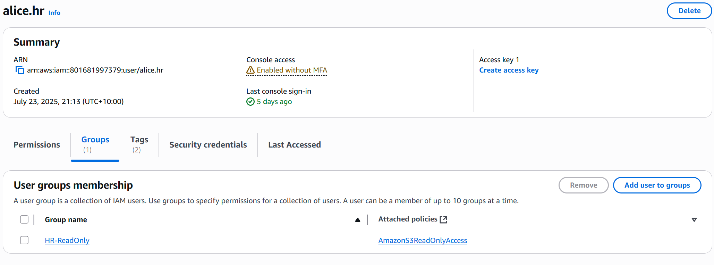
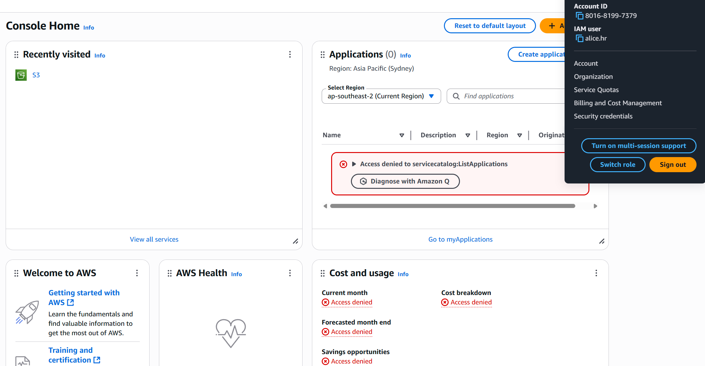
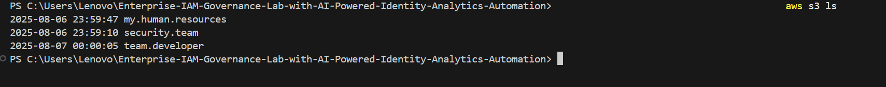
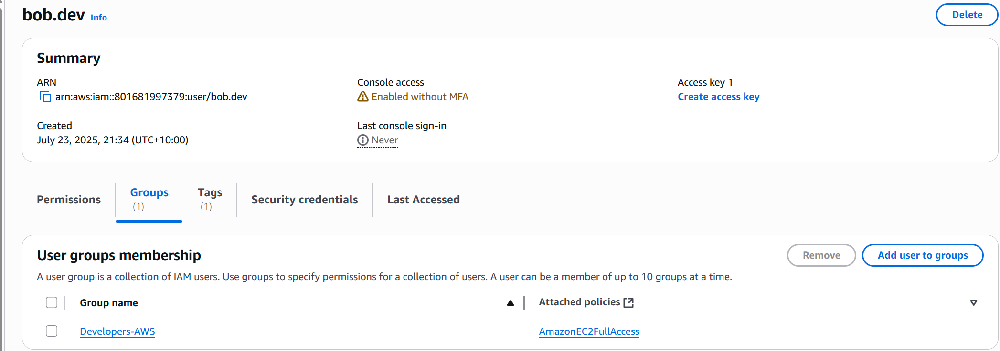
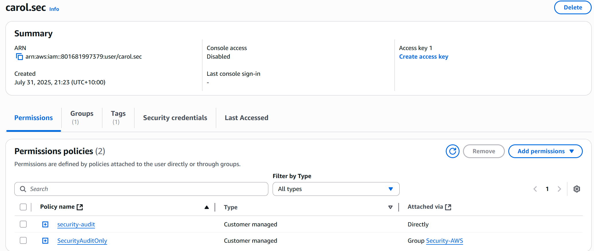
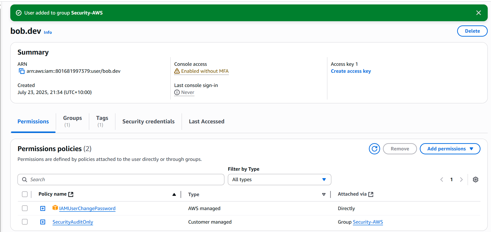
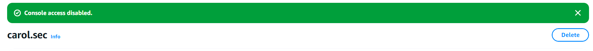
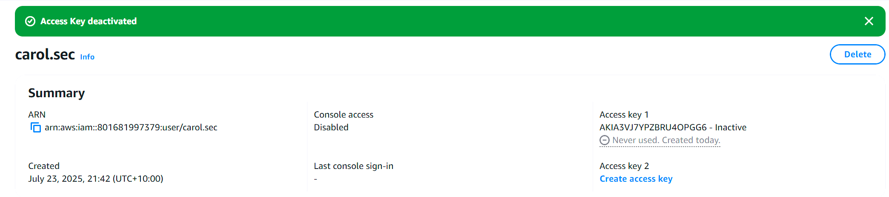
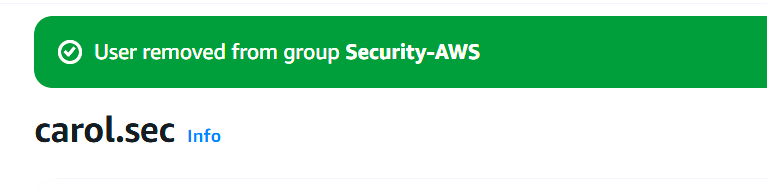

## 🧩 Phase 0: Project Setup (Before You Begin)

### ✅ Prerequisites to Install/Setup

| Tool                       | Purpose                                | How to Get It                                                                 |
|---------------------------|----------------------------------------|-------------------------------------------------------------------------------|
| **AWS Free Tier**         | For IAM, SSO, CloudTrail               | [Create an AWS Account](https://aws.amazon.com/free/)                         |
| **Microsoft Entra ID**    | Identity governance simulation         | [Create Microsoft Entra ID](https://www.microsoft.com/en-au/security/business/identity-access/microsoft-entra-id) |
| **Visual Studio Code**    | Code editing, Git, Python              | [Download VS Code](https://code.visualstudio.com/)                            |
| **Git**                   | Version control + GitHub push          | [Install Git](https://git-scm.com/)                                           |
| **Python 3.10+**          | AI & automation scripting              | [Install Python](https://www.python.org/downloads/)                           |
| **Jupyter / Google Colab**| AI Notebooks (Optional)                | [Open Google Colab](https://colab.research.google.com/)                       |
| **GitHub Repository**     | Showcase project online                | [Create a GitHub Repo](https://github.com/new)                                |

## 🔹 Phase 1 – Manual Joiner Setup (Identity Lifecycle Simulation)

In this phase, we manually provision IAM users via the AWS Console to understand the identity lifecycle before implementing automation in later phases.

---

### 🔧 Step-by-Step: Creating `alice.hr` (Joiner Simulation)

1. **Click “Create user”**  
   - Top-right orange button in AWS IAM Console.

2. **Set User Details**

   | Field                | Value                              |
   |----------------------|------------------------------------|
   | User name            | `alice.hr`                         |
   | Access type          | ✅ Programmatic + Console access    |
   | Console password     | Autogenerated                      |
   | Require reset        | ✅ Enabled                          |

   → Click **Next: Permissions**

3. **Assign to Group**

   - Click **Create group**  
   - Group Name: `HR-ReadOnly`  
   - Attach Policy: `AmazonS3ReadOnlyAccess` or `S3-ReadOnlyAccess`
   - Click **Create group**  
   - Select the group and proceed

4. **Add Tags**

   | Key         | Value |
   |-------------|--------|
   | Department  | HR     |

   → Click **Next: Review**

5. **Review & Create**

   - Username: `alice.hr`  
   - Group: `HR-ReadOnly`  
   - Policy: `AmazonS3ReadOnlyAccess` or `S3-ReadOnlyAccess`
   - Tag: `Department=HR`  
   → Click **Create User**

6. **Save Credentials**

   - Click **Download .CSV**
   - Save console URL, username, password, and access keys

7. **Test Access**

   - Log in via AWS Console with `alice.hr`
   - Try browsing S3 buckets  
   - ✅ Confirm read-only access (no upload/delete)
  

---

### 👨‍💻 Step-by-Step: Create `bob.dev` – Cloud Developer

Provision a developer user with EC2 access.

#### 📋 Configuration

| Field     | Value                                              |
|-----------|----------------------------------------------------|
| Username  | `bob.dev`                                          |
| Group     | `Developers-AWS`                                   |
| Policy    | `AmazonEC2FullAccess` _or_ custom `ec2-admin.json` |
| Tag       | `Department=Dev`                                   |

#### 🛠️ Steps

1. Go to **IAM > Users > Add user**
2. Enter username: `bob.dev`
3. Enable:
   - ✅ AWS Management Console access
   - ✅ Programmatic access
4. Set password to:
   - Autogenerated
   - ☑ Require password reset
5. **Create Group** (if not already created):
   - Group name: `Developers-AWS`
   - Attach policy:
     - ✅ Option 1: Use AWS managed `AmazonEC2FullAccess`
     - ✅ Option 2: Create and use a custom policy `ec2-admin.json`:
6. **Add Tag**  
   - Key: `Department`  
   - Value: `Dev`
7. **Review & Create**
   - Confirm:
     - Username: `bob.dev`
     - Group: `Developers-AWS`
     - Tag: `Department=Dev`
   - Click **Create User**

#### ✅ Test Bob’s Access (CLI) optional

aws ec2 describe-instances

---

### 🛡️ Step-by-Step: Create `carol.sec` – Security Analyst

Provision a security analyst with read-only access to IAM, CloudTrail, logs, and org metadata.

#### 📋 Configuration

| Field     | Value                     |
|-----------|---------------------------|
| Username  | `carol.sec`               |
| Group     | `Security-AWS`            |
| Policy    | Custom `security-audit.json` |
| Tag       | `Department=Security`     |

#### 🛠️ Steps

1. Go to **IAM > Users > Add user**
2. Enter username: `carol.sec`
3. Enable:
   - ✅ AWS Management Console access
   - ✅ Programmatic access
4. Set password to:
   - Autogenerated
   - ☑ Require password reset
5. **Create Group** (if not already created):
   - Group name: `Security-AWS`
   - Attach custom policy: `security-audit.json`
6. **Add Tag**  
   - Key: `Department`  
   - Value: `Security`
7. **Review & Create**
   - Confirm:
     - Username: `carol.sec`
     - Group: `Security-AWS`
     - Tag: `Department=Security`
   - Click **Create User**

## 🔄 Phase 1B: Simulate Mover & Leaver in AWS IAM

---

### 🔁 MOVER: Bob changes roles (Dev → Security Analyst)

👨‍💻 **Scenario**:  
Bob was a Developer, but is now transferring to the Security team. We need to:
- Remove him from `Developers-AWS` group  
- Add him to `Security-AWS` group  
- *(Optional)* Rotate his credentials or trigger reauthorization  

---

#### ✅ Step-by-Step: Bob's Role Change

1. Go to **IAM > Users > bob.dev**
2. Click **Groups** → Remove from `Developers-AWS`  
   - Click the ✖️ next to `Developers-AWS` to remove him  
3. Click **Add user to groups**  
   - Select or create `Security-AWS`  
   - Click **Add to groups**  
4. *(Optional for realism)*:  
   - Rotate Bob’s access keys (delete old + create new)  
   - Require Bob to reset his password again  

✅ **Bob now has access equivalent to a Security Analyst instead of Developer.**

---

### 🧹 LEAVER: Carol leaves the organization

👩‍💼 **Scenario**:  
Carol (Security Analyst) is leaving the company. We need to:
- Block her sign-in  
- Revoke programmatic and console access  
- Optionally delete her user record  

---

#### ✅ Step-by-Step: Carol Offboarding

1. Go to **IAM > Users > carol.sec**
2. In **Security credentials** tab:  
   - Under **Console access**, click “**Make inactive**”  
   - Under **Access keys**, click “**Deactivate**” (or **Delete** if preferred)  

3. Remove Carol from all groups:  
   - Click **Groups**  
   - Remove from `Security-AWS`  

4. *(Optional for full cleanup)*:  
   - Click **Delete user** (if fully terminated)  

💡 *In real orgs, we'd keep his/her record for 30–90 days in a disabled state for auditing.*  
✅ **Carol now has no access, and her identity is decommissioned.**

---

### ✅ Results Summary

| User       | Old Role         | Action Taken                         | Result                          |
|------------|------------------|--------------------------------------|---------------------------------|
| `bob.dev`  | Developer         | Moved to `Security-AWS` group        | Now acts as Security Analyst    |
| `carol.sec`| Security Analyst  | Access revoked, optionally deleted   | No longer active in IAM         |

