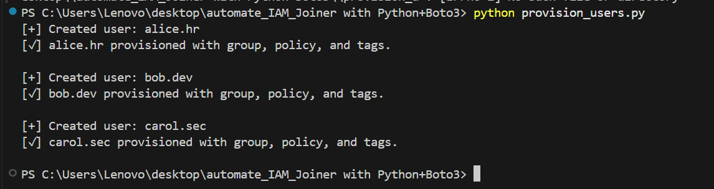
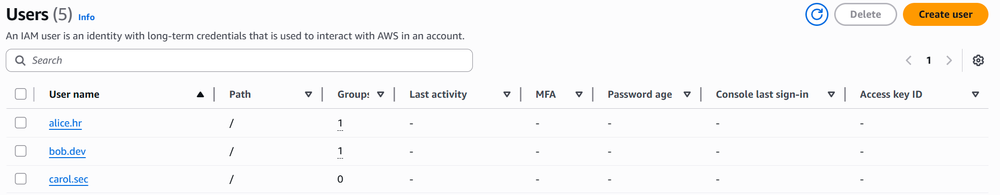

## 🔄 Phase 2: Automate IAM Joiner with Python + Boto3

---

### 🤖 Objective

Automate the **Joiner** phase of IAM lifecycle by provisioning new AWS IAM users from a CSV file using Python and Boto3.

This script simulates how enterprise environments automate identity creation, group assignment, tagging, and policy enforcement at scale.

---

### 📁 Files Used

- `users.csv`  
  Stores user metadata for bulk provisioning.

- `test_import.py`

- `provision_users.py` 

### 🧩 Python Scripts Overview

#### 📄 `test_import.py`  
A pre-check script used **before** provisioning to ensure your CSV file is valid.

✅ What it does:
- Validates CSV formatting
- Checks for required columns: `username`, `full_name`, `department`, `group`, `policy`
- Warns if any values are missing or malformed
- Prevents provisioning failures by catching errors early

🔍 **Run this first** to validate your data before using `provision_users.py`.

---

#### ⚙️ `provision_users.py`  
The main automation script that handles IAM user creation based on the CSV file.

✅ What it does:
- Creates IAM users (`iam.create_user`)
- Adds users to specified IAM groups (`iam.add_user_to_group`)
- Attaches IAM managed policies (`iam.attach_user_policy`)
- Tags users with metadata like `FullName` and `Department` (`iam.tag_user`)

🛡 This script simulates an automated **Joiner** workflow, aligning with IAM governance best practices.

---

### 📊 Results Summary

| Username   | Group          | Policy     | Tags Added             | Status          |
|------------|----------------|------------|-------------------------|------------------|
| alice.hr   | HR-AWS         | HRPolicy   | FullName, Department    | ✅ Provisioned    |
| bob.dev    | Developers-AWS | DevPolicy  | FullName, Department    | ✅ Provisioned    |
| carol.sec  | Security-AWS   | SecPolicy  | FullName, Department    | ✅ Provisioned    |

---

### 🧠 Pro Tips

- ✅ Always run `test_import.py` before provisioning to avoid script crashes.
- 🚫 Never run on production AWS accounts — use a sandbox or testing environment.
- 🛠 Ensure IAM groups and policies exist **before** executing `provision_users.py`.
- 🧩 You can extend the automation to:
  - Create login profiles (for console access)
  - Generate access keys and securely deliver to users
  - Integrate with AWS Secrets Manager or other credential vaults

---

### Phase 2 Outcome

IAM user onboarding is now **automated** with validation and clean provisioning flow using **Python + Boto3**.  
This simulates a real-world **Joiner process** in enterprise IAM Governance — enabling repeatable, secure, and scalable identity creation.

